# Onyx Backend Architecture Flow Diagram

This diagram shows the interconnections between all major modules in the Onyx backend system.

```mermaid
graph TB
    %% Main Application Entry
    MAIN[main.py<br/>FastAPI Application Entry]
    
    %% Core Configuration Layer
    CONFIGS[configs/<br/>Configuration Management]
    MAIN --> CONFIGS
    
    %% Database Layer
    DB[db/<br/>Database Layer]
    DB_ENGINE[db/engine/<br/>SQL Engine & Connections]
    DB_MODELS[db/models.py<br/>SQLAlchemy Models]
    DB --> DB_ENGINE
    DB --> DB_MODELS
    
    %% Authentication & Access Control
    AUTH[auth/<br/>Authentication System]
    ACCESS[access/<br/>Access Control]
    AUTH --> ACCESS
    MAIN --> AUTH
    
    %% Server Layer - API Endpoints
    SERVER[server/<br/>FastAPI Routes & Endpoints]
    SERVER_CHAT[server/query_and_chat/<br/>Chat & Query APIs]
    SERVER_DOCS[server/documents/<br/>Document Management APIs]
    SERVER_FEATURES[server/features/<br/>Feature-specific APIs]
    SERVER_MANAGE[server/manage/<br/>Administrative APIs]
    SERVER --> SERVER_CHAT
    SERVER --> SERVER_DOCS
    SERVER --> SERVER_FEATURES
    SERVER --> SERVER_MANAGE
    MAIN --> SERVER
    
    %% Chat System
    CHAT[chat/<br/>Chat Processing Engine]
    CHAT_TURN[chat/turn/<br/>Chat Turn Management]
    CHAT_MEMORIES[chat/memories.py<br/>Chat Memory System]
    CHAT_STREAM[chat/stream_processing/<br/>Stream Processing]
    CHAT_PROMPT[chat/prompt_builder/<br/>Prompt Construction]
    CHAT --> CHAT_TURN
    CHAT --> CHAT_MEMORIES
    CHAT --> CHAT_STREAM
    CHAT --> CHAT_PROMPT
    SERVER_CHAT --> CHAT
    
    %% Document Processing Pipeline
    DOC_INDEX[document_index/<br/>Document Indexing]
    DOC_VESPA[document_index/vespa/<br/>Vespa Vector Store]
    DOC_INDEX --> DOC_VESPA
    
    %% Connector System
    CONNECTORS[connectors/<br/>Data Source Connectors]
    CONN_FACTORY[connectors/factory.py<br/>Connector Factory]
    CONN_REGISTRY[connectors/registry.py<br/>Connector Registry]
    CONN_INTERFACES[connectors/interfaces.py<br/>Connector Interfaces]
    CONNECTORS --> CONN_FACTORY
    CONNECTORS --> CONN_REGISTRY
    CONNECTORS --> CONN_INTERFACES
    
    %% Background Processing
    BACKGROUND[background/<br/>Background Tasks]
    CELERY[background/celery/<br/>Celery Task Queue]
    INDEXING[background/indexing/<br/>Document Indexing Tasks]
    BACKGROUND --> CELERY
    BACKGROUND --> INDEXING
    
    %% File Processing
    FILE_PROC[file_processing/<br/>File Processing]
    FILE_STORE[file_store/<br/>File Storage]
    
    %% LLM Integration
    LLM[llm/<br/>LLM Integration]
    NATURAL_LANG[natural_language_processing/<br/>NLP Processing]
    
    %% Tools System
    TOOLS[tools/<br/>Tool Implementations]
    
    %% Knowledge Graph
    KG[kg/<br/>Knowledge Graph]
    
    %% Context & Search
    CONTEXT[context/<br/>Context Management]
    CONTEXT_SEARCH[context/search/<br/>Search Context]
    CONTEXT --> CONTEXT_SEARCH
    
    %% Utilities
    UTILS[utils/<br/>Utility Functions]
    REDIS[redis/<br/>Redis Integration]
    TRACING[tracing/<br/>Observability]
    
    %% Secondary LLM Flows
    SECONDARY_LLM[secondary_llm_flows/<br/>Secondary LLM Processing]
    
    %% Feature Flags
    FEATURE_FLAGS[feature_flags/<br/>Feature Flag System]
    
    %% Key Value Store
    KV_STORE[key_value_store/<br/>Key-Value Storage]
    
    %% HTTP Client
    HTTPX[httpx/<br/>HTTP Client Pool]
    
    %% Evaluation System
    EVALS[evals/<br/>Evaluation Framework]
    
    %% OnyxBot
    ONYXBOT[onyxbot/<br/>Bot Integration]
    
    %% Agents
    AGENTS[agents/<br/>AI Agents]
    AGENT_SEARCH[agents/agent_search/<br/>Agent Search System]
    AGENTS --> AGENT_SEARCH
    
    %% Federated Connectors
    FED_CONNECTORS[federated_connectors/<br/>Federated Connectors]
    
    %% Seeding
    SEEDING[seeding/<br/>Data Seeding]
    
    %% Main Data Flow Connections
    MAIN --> DB
    MAIN --> FILE_STORE
    MAIN --> REDIS
    MAIN --> HTTPX
    
    %% Chat Flow
    CHAT --> DB
    CHAT --> LLM
    CHAT --> NATURAL_LANG
    CHAT --> TOOLS
    CHAT --> CONTEXT_SEARCH
    CHAT --> AGENTS
    
    %% Document Processing Flow
    CONNECTORS --> BACKGROUND
    INDEXING --> DOC_INDEX
    INDEXING --> FILE_PROC
    INDEXING --> NATURAL_LANG
    DOC_INDEX --> DB
    FILE_PROC --> FILE_STORE
    
    %% Search Flow
    CONTEXT_SEARCH --> DOC_INDEX
    CONTEXT_SEARCH --> NATURAL_LANG
    CONTEXT_SEARCH --> DB
    
    %% Background Task Flow
    CELERY --> CONNECTORS
    CELERY --> INDEXING
    CELERY --> DB
    CELERY --> REDIS
    
    %% Configuration Dependencies
    CONFIGS --> DB
    CONFIGS --> LLM
    CONFIGS --> DOC_INDEX
    CONFIGS --> NATURAL_LANG
    
    %% Tool Dependencies
    TOOLS --> LLM
    TOOLS --> DB
    TOOLS --> CONTEXT_SEARCH
    
    %% Agent Dependencies
    AGENTS --> LLM
    AGENTS --> TOOLS
    AGENTS --> CONTEXT_SEARCH
    AGENTS --> DB
    
    %% Knowledge Graph Flow
    KG --> DB
    KG --> NATURAL_LANG
    KG --> DOC_INDEX
    
    %% Server API Dependencies
    SERVER_DOCS --> CONNECTORS
    SERVER_DOCS --> DB
    SERVER_FEATURES --> DB
    SERVER_FEATURES --> LLM
    SERVER_MANAGE --> DB
    SERVER_MANAGE --> CONNECTORS
    
    %% Utility Dependencies
    UTILS --> DB
    UTILS --> REDIS
    TRACING --> LLM
    TRACING --> CHAT
    
    %% Secondary LLM Dependencies
    SECONDARY_LLM --> LLM
    SECONDARY_LLM --> DB
    SECONDARY_LLM --> CHAT
    
    %% Feature Flag Dependencies
    FEATURE_FLAGS --> DB
    
    %% Key Value Store Dependencies
    KV_STORE --> REDIS
    KV_STORE --> DB
    
    %% Evaluation Dependencies
    EVALS --> LLM
    EVALS --> CHAT
    EVALS --> DB
    
    %% OnyxBot Dependencies
    ONYXBOT --> CHAT
    ONYXBOT --> DB
    ONYXBOT --> CONNECTORS
    
    %% Federated Connector Dependencies
    FED_CONNECTORS --> CONNECTORS
    FED_CONNECTORS --> AUTH
    
    %% Seeding Dependencies
    SEEDING --> DB
    SEEDING --> CONFIGS
    
    %% Styling
    classDef mainModule fill:#e1f5fe,stroke:#01579b,stroke-width:3px
    classDef coreModule fill:#f3e5f5,stroke:#4a148c,stroke-width:2px
    classDef dataModule fill:#e8f5e8,stroke:#1b5e20,stroke-width:2px
    classDef processingModule fill:#fff3e0,stroke:#e65100,stroke-width:2px
    classDef apiModule fill:#fce4ec,stroke:#880e4f,stroke-width:2px
    classDef utilModule fill:#f1f8e9,stroke:#33691e,stroke-width:1px
    
    class MAIN mainModule
    class DB,DB_ENGINE,DB_MODELS dataModule
    class CHAT,CHAT_TURN,CHAT_MEMORIES,CHAT_STREAM,CHAT_PROMPT coreModule
    class CONNECTORS,INDEXING,BACKGROUND,CELERY,FILE_PROC processingModule
    class SERVER,SERVER_CHAT,SERVER_DOCS,SERVER_FEATURES,SERVER_MANAGE apiModule
    class UTILS,REDIS,TRACING,CONFIGS utilModule
```



## Key Architectural Patterns

### 1. **Layered Architecture**
- **Presentation Layer**: `server/` - FastAPI routes and endpoints
- **Business Logic Layer**: `chat/`, `connectors/`, `tools/` - Core functionality
- **Data Access Layer**: `db/` - Database models and operations
- **Infrastructure Layer**: `utils/`, `redis/`, `httpx/` - Supporting services

### 2. **Event-Driven Processing**
- **Background Tasks**: `background/celery/` - Asynchronous processing
- **Document Pipeline**: Connectors → Indexing → Vector Store
- **Chat Processing**: Real-time streaming with background context

### 3. **Plugin Architecture**
- **Connectors**: `connectors/` - Pluggable data sources
- **Tools**: `tools/` - Extensible tool system
- **Agents**: `agents/` - AI agent implementations

### 4. **Data Flow Patterns**

#### Document Ingestion Flow:
```
External Data Source → Connector → Background Task → File Store → Document Processing → Vector Index → Database
```

#### Chat Query Flow:
```
User Query → Chat API → Context Search → Vector Search → LLM → Response Stream
```

#### Background Processing Flow:
```
Scheduled Tasks → Celery Queue → Connector Execution → Document Processing → Index Updates
```

### 5. **Key Dependencies**
- **Database**: Central data store for all modules
- **Redis**: Caching and task queue management
- **LLM**: Core AI processing for chat and embeddings
- **Vector Store**: Document search and retrieval
- **File Store**: Document and file persistence
