# Chat Internal Search Flow Diagram

This diagram shows the detailed flow of how internal search works when a user is chatting, including all background processes.

```mermaid
flowchart TB
    %% User Input
    Start([User Sends Chat Message]) --> API[POST /api/chat/send-message<br/>chat_backend.py]
    
    %% API Layer
    API --> Auth[Authentication & Authorization<br/>current_chat_accessible_user]
    Auth --> RateLimit[Rate Limit Check<br/>check_token_rate_limits]
    RateLimit --> StreamGen[stream_generator<br/>Creates Streaming Response]
    
    %% Chat Processing Entry
    StreamGen --> ProcessMsg[stream_chat_message_objects<br/>process_message.py]
    
    %% Initial Setup
    ProcessMsg --> GetSession[Get/Create Chat Session<br/>Load Persona & Config]
    GetSession --> CreateUserMsg{Create New<br/>User Message?}
    CreateUserMsg -->|Yes| SaveUserMsg[Save User Message to DB<br/>Not committed yet]
    CreateUserMsg -->|No| LoadHistory
    SaveUserMsg --> LoadHistory[Load Chat History<br/>create_chat_chain]
    
    %% Search Decision
    LoadHistory --> CheckSearch{Search Needed?<br/>check_if_need_search}
    
    CheckSearch -->|No Search| DirectLLM[Direct LLM Generation<br/>Skip to LLM Step]
    CheckSearch -->|Search Needed| SearchFlow[Search Pipeline Starts]
    
    %% Search Pipeline - Preprocessing
    SearchFlow --> SearchPipeline[SearchPipeline Initialization<br/>context/search/pipeline.py]
    SearchPipeline --> Preprocess[retrieval_preprocessing<br/>Query Analysis & Preparation]
    
    Preprocess --> QueryAnalysis{Query Analysis<br/>Enabled?}
    QueryAnalysis -->|Yes| AnalyzeQuery[Parallel Query Analysis:<br/>• Search Type Prediction<br/>• Source Filter Prediction<br/>• Time Cutoff Prediction<br/>• Keyword Extraction]
    QueryAnalysis -->|No| SkipAnalysis[Use Default Settings]
    
    AnalyzeQuery --> BuildQuery[Build SearchQuery Object]
    SkipAnalysis --> BuildQuery
    
    BuildQuery --> GenEmbedding[Generate Query Embedding<br/>get_query_embedding<br/>Model Server Call]
    GenEmbedding --> BuildFilters[Build Access Control Filters<br/>build_access_filters_for_user]
    BuildFilters --> FinalQuery[Final SearchQuery Ready]
    
    %% Retrieval Phase
    FinalQuery --> Retrieve[retrieve_chunks<br/>search_runner.py]
    
    Retrieve --> CheckFederated{Federated<br/>Connectors?}
    CheckFederated -->|Yes| FedRetrieval[Federated Retrieval<br/>Slack, Teams, etc.<br/>Parallel Execution]
    CheckFederated -->|No| NormalRetrieval
    
    FedRetrieval --> NormalRetrieval[doc_index_retrieval<br/>Vespa Vector Search]
    
    NormalRetrieval --> ParallelSearch[Parallel Search Execution:<br/>• Hybrid Retrieval Thread<br/>• Keyword Expansion Thread<br/>• Semantic Expansion Thread]
    
    ParallelSearch --> HybridSearch[hybrid_retrieval<br/>Vespa Query:<br/>• Semantic Search<br/>• Keyword Search<br/>• Hybrid Alpha Weighting<br/>• Recency Bias]
    
    HybridSearch --> ExtractChunks[Extract Chunks from Results<br/>Handle Large Chunk References<br/>Deduplicate Chunks]
    ExtractChunks --> CombineResults[Combine All Retrieval Results<br/>Sort by Score]
    
    %% Section Expansion
    CombineResults --> CensorChunks{EE Access<br/>Censoring?}
    CensorChunks -->|Yes| Censor[Post-Query Chunk Censoring<br/>Remove Unauthorized Chunks]
    CensorChunks -->|No| ExpandSections
    Censor --> ExpandSections[Expand to InferenceSections<br/>_get_sections]
    
    ExpandSections --> CheckFullDoc{Full Document<br/>Requested?}
    CheckFullDoc -->|Yes| FetchFullDoc[Fetch All Chunks<br/>for Selected Documents]
    CheckFullDoc -->|No| FetchSurrounding[Fetch Surrounding Chunks<br/>chunks_above + chunks_below]
    
    FetchFullDoc --> BuildSections[Build InferenceSections<br/>Group Chunks by Document]
    FetchSurrounding --> BuildSections
    
    %% Post-Processing
    BuildSections --> PostProcess[search_postprocessing<br/>Parallel Post-Processing]
    
    PostProcess --> CheckRerank{Reranking<br/>Enabled?}
    CheckRerank -->|Yes| RerankTask[Rerank Task Thread:<br/>semantic_reranking<br/>Cross-Encoder Model<br/>Boost + Recency Weighting]
    CheckRerank -->|No| CheckLLMFilter
    
    RerankTask --> CheckLLMFilter{LLM Filtering<br/>Enabled?}
    CheckLLMFilter -->|Yes| LLMFilterTask[LLM Filter Task Thread:<br/>filter_sections<br/>llm_batch_eval_sections<br/>Relevance Evaluation]
    CheckLLMFilter -->|No| WaitParallel
    
    LLMFilterTask --> WaitParallel[Wait for Parallel Tasks<br/>run_functions_in_parallel]
    RerankTask --> WaitParallel
    
    WaitParallel --> FinalSections[Final Reranked & Filtered Sections]
    
    %% Document Pruning
    FinalSections --> PruneDocs[Document Pruning<br/>Apply Token Limits<br/>max_chunks / max_window_percentage]
    PruneDocs --> StreamDocs[Stream Retrieved Documents<br/>to Frontend]
    
    %% LLM Generation
    StreamDocs --> BuildPrompt[Build LLM Prompt<br/>Include:<br/>• System Prompt<br/>• Chat History<br/>• Retrieved Context<br/>• User Files<br/>• Project Files]
    
    BuildPrompt --> LLMGen[LLM Generation<br/>Streaming Response<br/>LiteLLM Integration]
    DirectLLM --> BuildPrompt
    
    LLMGen --> StreamTokens[Stream LLM Tokens<br/>to Frontend]
    StreamTokens --> SaveResponse[Save Assistant Message<br/>to Database<br/>Commit Transaction]
    SaveResponse --> End([Response Complete])
    
    %% Background Processes (Running Continuously)
    subgraph Background["Background Processes (Celery Workers)"]
        direction TB
        
        %% Indexing Background
        IndexCheck[check_for_indexing<br/>Every 15 seconds<br/>Celery Beat]
        IndexCheck --> ConnectorCheck{Connector Needs<br/>Indexing?}
        ConnectorCheck -->|Yes| DocFetch[docfetching_proxy_task<br/>Docfetching Worker]
        DocFetch --> FetchDocs[Fetch Documents from Connector<br/>Store Batches in File Store]
        FetchDocs --> SpawnProcess[Spawn docprocessing_task<br/>for Each Batch]
        SpawnProcess --> DocProcess[docprocessing_task<br/>Docprocessing Worker]
        DocProcess --> ProcessSteps[Processing Steps:<br/>1. Upsert to PostgreSQL<br/>2. Chunk Documents<br/>3. Generate Embeddings<br/>4. Write to Vespa<br/>5. Update Metadata]
        
        %% KG Processing
        KGCheck[check_for_kg_processing<br/>Every 60 seconds<br/>Celery Beat]
        KGCheck --> KGProcess[kg_processing<br/>KG Processing Worker]
        KGProcess --> KGExtract[Knowledge Graph Extraction<br/>Entity & Relationship Extraction]
        KGExtract --> KGCluster[Knowledge Graph Clustering<br/>Build Relationships]
        
        %% Monitoring
        MonitorCheck[monitor_background_processes<br/>Every 5 minutes<br/>Celery Beat]
        MonitorCheck --> Monitor[Monitor System Health<br/>• Celery Queue Status<br/>• Process Memory<br/>• Worker Heartbeats]
        
        %% Pruning
        PruneCheck[check_for_pruning<br/>Every 20 seconds<br/>Celery Beat]
        PruneCheck --> PruneTask[Pruning Tasks<br/>Heavy Worker<br/>Delete Old Documents]
        
        %% Permission Sync
        PermSync[connector_permission_sync<br/>Light Worker<br/>Sync External Permissions]
        
        %% Vespa Sync
        VespaSync[vespa_metadata_sync<br/>Light Worker<br/>Sync Metadata to Vespa]
    end
    
    %% Connections from Main Flow to Background
    HybridSearch -.->|Reads from| ProcessSteps
    ProcessSteps -.->|Updates| HybridSearch
    
    style Start fill:#e1f5fe,stroke:#01579b,stroke-width:3px
    style End fill:#e1f5fe,stroke:#01579b,stroke-width:3px
    style SearchFlow fill:#fff3e0,stroke:#e65100,stroke-width:2px
    style HybridSearch fill:#f3e5f5,stroke:#4a148c,stroke-width:2px
    style LLMGen fill:#e8f5e9,stroke:#1b5e20,stroke-width:2px
    style Background fill:#fce4ec,stroke:#880e4f,stroke-width:2px
    style ProcessSteps fill:#fff9c4,stroke:#f57f17,stroke-width:2px
```



## Detailed Flow Explanation

### 1. User Request & Authentication
- User sends message via frontend → `POST /api/chat/send-message`
- Authentication and rate limiting checks
- Streaming response generator created

### 2. Chat Session Setup
- Load or create chat session
- Get persona configuration
- Create user message (if new)
- Load chat history chain

### 3. Search Decision
- **LLM-based decision**: `check_if_need_search()` uses fast LLM to determine if search is needed
- Considers chat history and current query
- Can be forced via `forceSearch` or `queryOverride`

### 4. Search Pipeline - Preprocessing
- **Query Analysis** (parallel execution):
  - Search type prediction (keyword/semantic/hybrid)
  - Source filter prediction
  - Time cutoff prediction
  - Keyword extraction
- **Query Embedding**: Generate semantic embedding via model server
- **Filter Building**: Access control filters based on user permissions
- **Query Expansion**: Multilingual expansion if enabled

### 5. Retrieval Phase
- **Parallel Retrieval**:
  - **Federated Retrieval**: External sources (Slack, Teams, etc.) if configured
  - **Vespa Hybrid Search**: 
    - Semantic search (vector similarity)
    - Keyword search (BM25)
    - Hybrid combination with alpha weighting
    - Recency bias application
- **Query Expansion Retrieval**: Additional searches with expanded queries
- **Chunk Extraction**: Extract chunks, handle large chunk references, deduplicate

### 6. Section Expansion
- **Access Control**: EE feature - censor unauthorized chunks
- **Context Expansion**: 
  - Fetch surrounding chunks (`chunks_above`, `chunks_below`)
  - Or fetch full document if `full_doc=true`
- **Section Building**: Group chunks into `InferenceSection` objects

### 7. Post-Processing (Parallel)
- **Reranking** (if enabled):
  - Cross-encoder model scores chunks
  - Applies boost multipliers
  - Applies recency weighting
  - Re-sorts by new scores
- **LLM Filtering** (if enabled):
  - LLM evaluates each section for relevance
  - Filters out non-useful sections
  - Returns selected chunk IDs

### 8. Document Pruning
- Apply token limits based on:
  - `max_chunks` from persona
  - `max_window_percentage` (default 0.3)
  - Model context window size
- Prioritize higher-scored sections

### 9. LLM Generation
- Build prompt with:
  - System prompt (from persona)
  - Chat history
  - Retrieved context sections
  - User-uploaded files
  - Project files
- Stream LLM response tokens
- Save assistant message to database

### 10. Background Processes (Continuous)

#### Document Indexing
- **check_for_indexing** (every 15s): Checks if connectors need indexing
- **docfetching_proxy_task**: Fetches documents from external sources
- **docprocessing_task**: Processes batches:
  1. Upserts to PostgreSQL
  2. Chunks documents
  3. Generates embeddings (model server)
  4. Writes to Vespa vector DB
  5. Updates metadata

#### Knowledge Graph Processing
- **check_for_kg_processing** (every 60s): Processes KG extraction and clustering
- Extracts entities and relationships
- Builds document clusters

#### Monitoring
- **monitor_background_processes** (every 5min): System health checks
- Monitors Celery queues, memory, heartbeats

#### Pruning
- **check_for_pruning** (every 20s): Deletes old documents based on retention policies

#### Permission Sync
- Syncs external permissions (e.g., Confluence, SharePoint)
- Updates access control lists

#### Vespa Metadata Sync
- Syncs metadata changes to Vespa index

## Key Components

### Synchronous (Request-Response)
- Query preprocessing
- Vector search retrieval
- Section expansion
- Reranking
- LLM filtering
- Document pruning
- LLM generation

### Asynchronous (Background)
- Document indexing
- Knowledge graph processing
- Permission synchronization
- Metadata synchronization
- System monitoring
- Document pruning

## Performance Optimizations

1. **Parallel Execution**:
   - Multiple retrieval methods run in parallel
   - Reranking and LLM filtering run in parallel
   - Query analysis tasks run in parallel

2. **Streaming**:
   - Documents streamed to frontend as soon as available
   - LLM tokens streamed in real-time
   - Non-blocking response generation

3. **Caching**:
   - Query embeddings cached
   - Document metadata cached
   - Access control filters cached

4. **Background Processing**:
   - Indexing happens asynchronously
   - No impact on chat response time
   - Continuous document updates

## Code References

- **Chat Entry**: ```425:452:backend/onyx/server/query_and_chat/chat_backend.py```
- **Chat Processing**: ```318:931:backend/onyx/chat/process_message.py```
- **Search Decision**: ```51:99:backend/onyx/secondary_llm_flows/choose_search.py```
- **Search Pipeline**: ```50:491:backend/onyx/context/search/pipeline.py```
- **Retrieval**: ```122:410:backend/onyx/context/search/retrieval/search_runner.py```
- **Reranking**: ```219:353:backend/onyx/context/search/postprocessing/postprocessing.py```
- **LLM Filtering**: ```357:398:backend/onyx/context/search/postprocessing/postprocessing.py```
- **Indexing Tasks**: ```307:385:backend/onyx/background/celery/tasks/docfetching/tasks.py```
- **KG Processing**: ```111:162:backend/onyx/background/celery/tasks/kg_processing/tasks.py```


