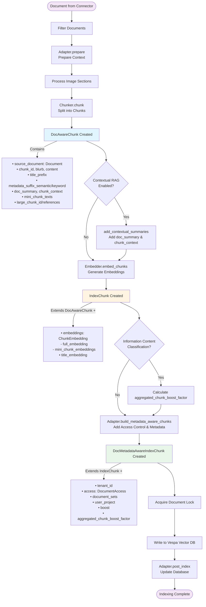

# DocAwareChunk and IndexChunk Flow Explanation

This document explains the flow from raw documents to indexed chunks in the Onyx indexing pipeline.

## Overview

The indexing pipeline transforms documents through several stages, creating progressively enriched chunk objects:

1. **Document** → Raw document from connector
2. **DocAwareChunk** → Chunked document with full document context
3. **IndexChunk** → DocAwareChunk with embeddings added
4. **DocMetadataAwareIndexChunk** → IndexChunk with access control and metadata
5. **Vespa Index** → Final indexed chunks in vector database

## Flowchart



## Detailed Stage Explanations

### 1. DocAwareChunk Stage

**Location**: `backend/onyx/indexing/chunker.py`

**Purpose**: Creates chunks that maintain full awareness of their source document during indexing.

**Key Properties**:
- `source_document`: Full `Document` object reference (only available during indexing)
- `chunk_id`: Sequential ID within the document
- `blurb`: First sentence(s) of the chunk
- `content`: The actual chunk text content
- `title_prefix`: Document title (may be empty if too long)
- `metadata_suffix_semantic/keyword`: Metadata strings for semantic/keyword search
- `doc_summary`: Document-level summary for contextual RAG
- `chunk_context`: Chunk-specific context within document
- `mini_chunk_texts`: Smaller sub-chunks for multipass retrieval
- `large_chunk_id`: Reference to parent large chunk (if multipass enabled)

**Why "DocAware"?**
During indexing, we have access to the complete `Document` object, allowing us to:
- Add document-level context to chunks
- Generate document summaries
- Access full metadata
- Build relationships between chunks

During inference (query time), we only have document IDs, so we use `InferenceChunk` instead.

### 2. IndexChunk Stage

**Location**: `backend/onyx/indexing/embedder.py`

**Purpose**: Adds vector embeddings to DocAwareChunks for semantic search.

**Key Additions**:
- `embeddings`: `ChunkEmbedding` containing:
  - `full_embedding`: Embedding of the complete chunk text
  - `mini_chunk_embeddings`: Embeddings for mini chunks (if multipass enabled)
- `title_embedding`: Optional embedding of the document title

**Embedding Process**:
1. Constructs chunk text: `title_prefix + doc_summary + content + chunk_context + metadata_suffix_semantic`
2. Generates embeddings for all chunk texts (batch processing)
3. Generates title embeddings separately (cached per document)
4. Creates `IndexChunk` objects with embeddings attached

### 3. DocMetadataAwareIndexChunk Stage

**Location**: `backend/onyx/indexing/adapters/document_indexing_adapter.py`

**Purpose**: Adds access control, document sets, and boost information needed for indexing.

**Key Additions**:
- `tenant_id`: Multi-tenant isolation
- `access`: `DocumentAccess` object with user/group permissions
- `document_sets`: Document sets for filtering/personas
- `user_project`: User project associations
- `boost`: Document-level boost score
- `aggregated_chunk_boost_factor`: Chunk-level boost (e.g., information content score)

**Why Separate?**
This metadata is fetched from the database and added just before indexing to ensure:
- Access control is up-to-date
- Document sets are current
- Boost scores reflect latest calculations
- Race conditions are minimized (done within document lock)

### 4. Indexing to Vespa

**Location**: `backend/onyx/document_index/vespa/`

The `DocMetadataAwareIndexChunk` objects are written to Vespa vector database with:
- All chunk content and metadata
- Embeddings for semantic search
- Access control information for filtering
- Boost scores for ranking

## Key Differences

| Aspect | DocAwareChunk | IndexChunk |
|--------|---------------|------------|
| **Stage** | After chunking | After embedding |
| **Has Embeddings?** | ❌ No | ✅ Yes |
| **Has Source Document?** | ✅ Yes (full object) | ✅ Yes (full object) |
| **Purpose** | Chunk structure with document context | Ready for vector search |
| **Used For** | Chunking, contextual RAG | Embedding generation, indexing |

## Code References

- **DocAwareChunk Definition**: ```45:85:backend/onyx/indexing/models.py```
- **IndexChunk Definition**: ```87:90:backend/onyx/indexing/models.py```
- **Chunking Process**: ```514:521:backend/onyx/indexing/chunker.py```
- **Embedding Process**: ```113:118:backend/onyx/indexing/embedder.py```
- **Indexing Pipeline**: ```660:835:backend/onyx/indexing/indexing_pipeline.py```

## Notes

- **During Inference**: At query time, chunks are retrieved as `InferenceChunk` objects which only contain document IDs, not full `Document` objects
- **Multipass Retrieval**: Mini chunks enable two-stage retrieval (large chunk → mini chunks) for better precision
- **Contextual RAG**: Document summaries and chunk context improve retrieval quality by providing document-level understanding
- **Access Control**: Metadata is added just before indexing to ensure permissions are current

