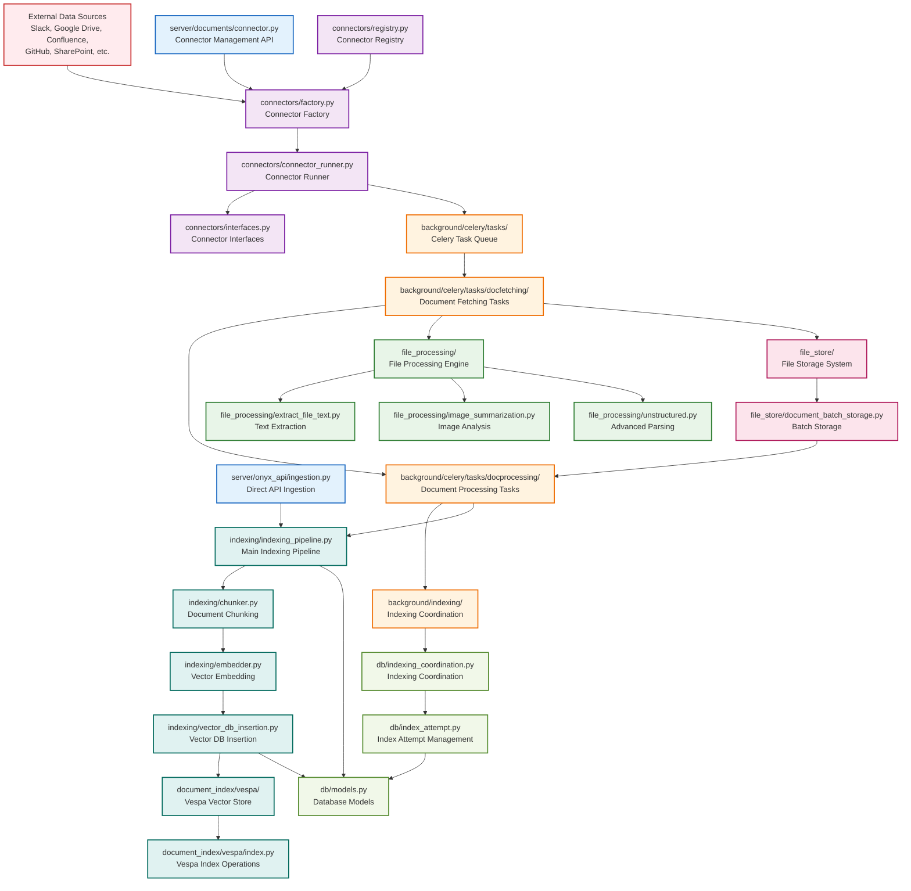

# Document Ingestion Flow Diagram



## Detailed Processing Steps

### 1. **Document Extraction Phase**
```
External Source → Connector Factory → Connector Runner → Document Batches
```

**Key Folders:**
- `connectors/` - All connector implementations
- `background/celery/tasks/docfetching/` - Document fetching tasks

### 2. **File Processing Phase**
```
Document Batches → File Store → Text Extraction → Image Analysis → Processed Content
```

**Key Folders:**
- `file_processing/` - Text and image processing
- `file_store/` - File storage management

### 3. **Indexing Pipeline Phase**
```
Processed Content → Chunking → Embedding → Vector Database → Database Metadata
```

**Key Folders:**
- `indexing/` - Core indexing pipeline
- `document_index/vespa/` - Vector database operations

### 4. **Coordination and Monitoring**
```
Index Attempts → Progress Tracking → Error Handling → Completion Status
```

**Key Folders:**
- `db/indexing_coordination.py` - Indexing coordination
- `db/index_attempt.py` - Attempt management

## Key Features by Folder

### **Connectors** (`connectors/`)
- **30+ Data Sources**: Slack, Google Drive, Confluence, GitHub, etc.
- **Pluggable Architecture**: Easy to add new connectors
- **Credential Management**: Secure credential handling
- **Checkpointing**: Resume from failures

### **Background Processing** (`background/`)
- **Celery Task Queue**: Asynchronous processing
- **Fault Tolerance**: Error handling and retry logic
- **Progress Tracking**: Real-time status updates
- **Resource Management**: Memory and CPU optimization

### **File Processing** (`file_processing/`)
- **Multi-format Support**: PDF, DOCX, images, code, etc.
- **AI Integration**: Image analysis and summarization
- **Advanced Parsing**: Unstructured.io integration
- **Content Validation**: Quality checks and filtering

### **Indexing Pipeline** (`indexing/`)
- **Smart Chunking**: Semantic document chunking
- **Vector Embeddings**: Multiple embedding models
- **Batch Processing**: Efficient batch operations
- **Context Enhancement**: Rich contextual information

### **Vector Database** (`document_index/`)
- **Vespa Integration**: High-performance vector search
- **Scalable Storage**: Handles large document collections
- **Real-time Updates**: Live index updates
- **Advanced Search**: Complex query capabilities

### **Database Layer** (`db/`)
- **Coordination**: Prevents duplicate processing
- **Progress Tracking**: Detailed status monitoring
- **Metadata Storage**: Document and chunk metadata
- **Error Management**: Comprehensive error tracking

This architecture provides a robust, scalable, and fault-tolerant document ingestion system that can handle diverse data sources and processing requirements.

