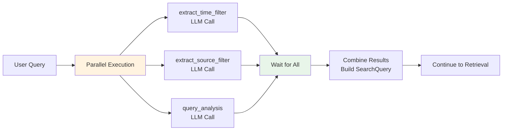
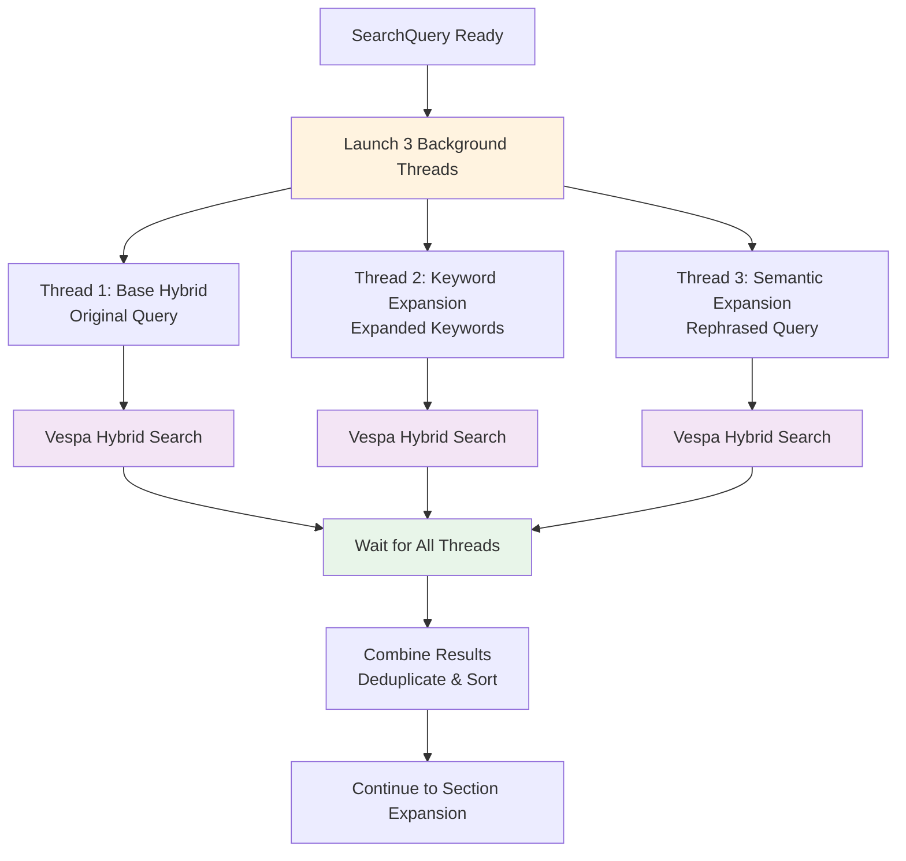
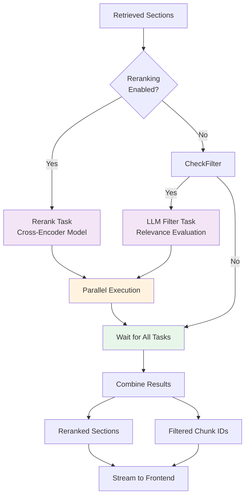

# Three Parallel Execution Points in Chat Search

This document explains the three main parallel execution points in the Onyx chat search flow, which significantly improve response latency by running independent operations concurrently.

## Overview

The chat search flow has three key parallel execution points:

1. **Query Analysis Parallel Execution** - Multiple LLM-based query analysis tasks
2. **Retrieval Parallel Execution** - Multiple search methods running simultaneously
3. **Post-Processing Parallel Execution** - Reranking and LLM filtering in parallel

---

## 1. Query Analysis Parallel Execution

**Location**: `backend/onyx/context/search/preprocessing/preprocessing.py`

**Purpose**: Analyze the user's query to extract filters, determine search type, and optimize retrieval parameters - all done in parallel to minimize latency.

### What Runs in Parallel

```python
# From retrieval_preprocessing function
functions_to_run = [
    filter_fn
    for filter_fn in [
        run_time_filters,      # Extract time cutoff from query
        run_source_filters,   # Extract source type filters
        run_query_analysis,   # Determine if keyword/semantic search
    ]
    if filter_fn
]
parallel_results = run_functions_in_parallel(functions_to_run)
```

### The Three Tasks

#### Task 1: Time Filter Extraction (`extract_time_filter`)
- **What it does**: Uses LLM to extract time-related information from the query
- **Examples**: 
  - "What happened last week?" → extracts date range
  - "Recent updates" → applies recency bias
- **Output**: `(predicted_time_cutoff, predicted_favor_recent)`
- **Code**: ```106:110:backend/onyx/context/search/preprocessing/preprocessing.py```

#### Task 2: Source Filter Extraction (`extract_source_filter`)
- **What it does**: Uses LLM to identify which data sources the query targets
- **Examples**:
  - "Check Slack messages" → filters to Slack source
  - "Search Confluence docs" → filters to Confluence source
- **Output**: `predicted_source_filters` (list of source types)
- **Code**: ```112:117:backend/onyx/context/search/preprocessing/preprocessing.py```

#### Task 3: Query Analysis (`query_analysis`)
- **What it does**: Determines if query is better suited for keyword or semantic search
- **Examples**:
  - "Python error handling" → likely keyword search
  - "How do I handle exceptions?" → likely semantic search
- **Output**: `(is_keyword, extracted_keywords)`
- **Code**: ```121:125:backend/onyx/context/search/preprocessing/preprocessing.py```

### Execution Flow



### Why Parallel?

- **Latency Reduction**: Instead of 3 sequential LLM calls (~3-6 seconds total), all run simultaneously (~1-2 seconds)
- **Independence**: Each task is independent - no dependencies between them
- **Better UX**: Faster response time for users

### Code Reference

```127:155:backend/onyx/context/search/preprocessing/preprocessing.py
functions_to_run = [
    filter_fn
    for filter_fn in [
        run_time_filters,
        run_source_filters,
        run_query_analysis,
    ]
    if filter_fn
]
parallel_results = run_functions_in_parallel(functions_to_run)

predicted_time_cutoff, predicted_favor_recent = (
    parallel_results[run_time_filters.result_id]
    if run_time_filters
    else (None, None)
)
predicted_source_filters = (
    parallel_results[run_source_filters.result_id] if run_source_filters else None
)

is_keyword, _extracted_keywords = False, None
if search_request.precomputed_is_keyword is not None:
    is_keyword = search_request.precomputed_is_keyword
    _extracted_keywords = search_request.precomputed_keywords
elif run_query_analysis:
    is_keyword, _extracted_keywords = parallel_results[run_query_analysis.result_id]
```

---

## 2. Retrieval Parallel Execution

**Location**: `backend/onyx/context/search/retrieval/search_runner.py`

**Purpose**: Execute multiple search strategies simultaneously to maximize recall and find the most relevant documents.

### What Runs in Parallel

The retrieval phase can run up to **3 different search queries** in parallel:

1. **Base Hybrid Retrieval** - Original query with hybrid search
2. **Keyword Expansion Retrieval** - Query expanded for keyword matching
3. **Semantic Expansion Retrieval** - Query expanded for semantic matching

### The Three Retrieval Threads

#### Thread 1: Base Hybrid Retrieval
```python
top_base_chunks_standard_ranking_thread = run_in_background(
    document_index.hybrid_retrieval,
    query.query,                    # Original query
    query_embedding,                # Original embedding
    query.processed_keywords,
    query.filters,
    query.hybrid_alpha,             # Hybrid weighting
    query.recency_bias_multiplier,
    query.num_hits,
    QueryExpansionType.SEMANTIC,
    query.offset,
)
```
- **What it does**: Performs hybrid search (semantic + keyword) on the original query
- **Search type**: Hybrid (combines vector similarity + BM25 keyword matching)
- **Code**: ```153:164:backend/onyx/context/search/retrieval/search_runner.py```

#### Thread 2: Keyword Expansion Retrieval
```python
top_keyword_chunks_thread = run_in_background(
    document_index.hybrid_retrieval,
    query.expanded_queries.keywords_expansions[0],  # Expanded query
    keyword_embeddings[0],
    query.processed_keywords,
    query.filters,
    HYBRID_ALPHA_KEYWORD,           # More weight on keywords
    query.recency_bias_multiplier,
    query.num_hits,
    QueryExpansionType.KEYWORD,
    query.offset,
)
```
- **What it does**: Searches with keyword-expanded query (e.g., "error handling" → "error, exception, try-catch")
- **Search type**: Keyword-focused hybrid search
- **Code**: ```194:205:backend/onyx/context/search/retrieval/search_runner.py```

#### Thread 3: Semantic Expansion Retrieval
```python
top_semantic_chunks_thread = run_in_background(
    document_index.hybrid_retrieval,
    query.expanded_queries.semantic_expansions[0],  # Semantically expanded
    semantic_embeddings[0],
    query.processed_keywords,
    query.filters,
    HYBRID_ALPHA,                   # Standard hybrid weighting
    query.recency_bias_multiplier,
    query.num_hits,
    QueryExpansionType.SEMANTIC,
    query.offset,
)
```
- **What it does**: Searches with semantically expanded query (rephrased for better semantic matching)
- **Search type**: Semantic-focused hybrid search
- **Only runs if**: `query.search_type == SearchType.SEMANTIC`
- **Code**: ```210:221:backend/onyx/context/search/retrieval/search_runner.py```

### Execution Flow



### Why Parallel?

- **Maximize Recall**: Different search strategies find different relevant documents
- **Coverage**: Keyword search finds exact matches, semantic finds conceptual matches
- **Speed**: All Vespa queries run simultaneously instead of sequentially
- **Better Results**: Combining results from multiple strategies improves overall relevance

### Result Combination

After all threads complete, results are:
1. **Combined**: `all_top_chunks = base + keyword + semantic`
2. **Deduplicated**: Remove duplicate chunks (same document_id + chunk_id)
3. **Sorted**: By score (highest first)

```python
all_top_chunks = top_base_chunks_standard_ranking + top_keyword_chunks

if query.search_type == SearchType.SEMANTIC and top_semantic_chunks is not None:
    all_top_chunks += top_semantic_chunks

top_chunks = _dedupe_chunks(all_top_chunks)
```

### Code Reference

```152:241:backend/onyx/context/search/retrieval/search_runner.py
# Launch base retrieval in background
top_base_chunks_standard_ranking_thread = run_in_background(
    document_index.hybrid_retrieval,
    query.query,
    query_embedding,
    query.processed_keywords,
    query.filters,
    query.hybrid_alpha,
    query.recency_bias_multiplier,
    query.num_hits,
    QueryExpansionType.SEMANTIC,
    query.offset,
)

# If query expansion enabled, launch additional threads
if query.expanded_queries and query.expanded_queries.keywords_expansions:
    keyword_embeddings_thread = run_in_background(
        get_query_embeddings,
        query.expanded_queries.keywords_expansions,
        db_session,
    )
    
    top_keyword_chunks_thread = run_in_background(
        document_index.hybrid_retrieval,
        query.expanded_queries.keywords_expansions[0],
        keyword_embeddings[0],
        # ... parameters
    )
    
    if query.search_type == SearchType.SEMANTIC:
        top_semantic_chunks_thread = run_in_background(
            document_index.hybrid_retrieval,
            query.expanded_queries.semantic_expansions[0],
            semantic_embeddings[0],
            # ... parameters
        )

# Wait for all threads
top_base_chunks_standard_ranking = wait_on_background(
    top_base_chunks_standard_ranking_thread
)
top_keyword_chunks = wait_on_background(top_keyword_chunks_thread)
if query.search_type == SearchType.SEMANTIC:
    top_semantic_chunks = wait_on_background(top_semantic_chunks_thread)

# Combine results
all_top_chunks = top_base_chunks_standard_ranking + top_keyword_chunks
if query.search_type == SearchType.SEMANTIC and top_semantic_chunks is not None:
    all_top_chunks += top_semantic_chunks

top_chunks = _dedupe_chunks(all_top_chunks)
```

---

## 3. Post-Processing Parallel Execution

**Location**: `backend/onyx/context/search/postprocessing/postprocessing.py`

**Purpose**: Improve result quality by reranking and filtering - both operations run in parallel since they're independent.

### What Runs in Parallel

Two post-processing tasks that can run simultaneously:

1. **Reranking** - Re-score chunks using cross-encoder model
2. **LLM Filtering** - Filter out irrelevant sections using LLM evaluation

### The Two Tasks

#### Task 1: Reranking (`rerank_sections`)
```python
post_processing_tasks.append(
    FunctionCall(
        rerank_sections,
        (
            search_query.query,
            search_query.rerank_settings,
            retrieved_sections,
            rerank_metrics_callback,
        ),
    )
)
```

- **What it does**: 
  - Uses cross-encoder model to re-score chunks
  - Applies boost multipliers and recency weighting
  - Re-sorts sections by new scores
- **Model**: Cross-encoder reranking model (e.g., `cross-encoder/ms-marco-MiniLM`)
- **Input**: Top N sections (configurable via `rerank_settings.num_rerank`)
- **Output**: Re-ranked list of sections
- **Code**: ```417:429:backend/onyx/context/search/postprocessing/postprocessing.py```

#### Task 2: LLM Filtering (`filter_sections`)
```python
post_processing_tasks.append(
    FunctionCall(
        filter_sections,
        (
            search_query,
            retrieved_sections[: search_query.max_llm_filter_sections],
            llm,
        ),
    )
)
```

- **What it does**:
  - Uses LLM to evaluate each section for relevance
  - Filters out sections marked as "not useful"
  - Returns list of relevant chunk IDs
- **LLM Prompt**: Evaluates if section is useful for answering the query
- **Input**: Top M sections (configurable via `max_llm_filter_sections`)
- **Output**: List of relevant section IDs
- **Code**: ```442:459:backend/onyx/context/search/postprocessing/postprocessing.py```

### Execution Flow



### Why Parallel?

- **Independence**: Reranking and filtering are independent operations
- **Different Models**: Reranking uses cross-encoder, filtering uses main LLM
- **Latency**: Both can run simultaneously instead of sequentially
- **Better UX**: Results streamed to frontend as soon as reranking completes

### Task Execution

```python
post_processing_results = (
    run_functions_in_parallel(post_processing_tasks)
    if post_processing_tasks
    else {}
)

# Extract reranked sections
reranked_sections = cast(
    list[InferenceSection] | None,
    post_processing_results.get(str(rerank_task_id)) if rerank_task_id else None,
)

# Extract filtered chunk IDs
llm_selected_section_ids = (
    [
        section.center_chunk.unique_id
        for section in post_processing_results.get(str(llm_filter_task_id), [])
    ]
    if llm_filter_task_id
    else []
)
```

### Code Reference

```401:495:backend/onyx/context/search/postprocessing/postprocessing.py
def search_postprocessing(
    search_query: SearchQuery,
    retrieved_sections: list[InferenceSection],
    llm: LLM,
    rerank_metrics_callback: Callable[[RerankMetricsContainer], None] | None = None,
) -> Iterator[list[InferenceSection] | list[SectionRelevancePiece]]:
    post_processing_tasks: list[FunctionCall] = []

    # Add reranking task if enabled
    if should_rerank(search_query.rerank_settings):
        post_processing_tasks.append(
            FunctionCall(
                rerank_sections,
                (
                    search_query.query,
                    search_query.rerank_settings,
                    retrieved_sections,
                    rerank_metrics_callback,
                ),
            )
        )
        rerank_task_id = post_processing_tasks[-1].result_id

    # Add LLM filtering task if enabled
    if not DISABLE_LLM_DOC_RELEVANCE and search_query.evaluation_type in [
        LLMEvaluationType.BASIC,
        LLMEvaluationType.UNSPECIFIED,
    ]:
        post_processing_tasks.append(
            FunctionCall(
                filter_sections,
                (
                    search_query,
                    retrieved_sections[: search_query.max_llm_filter_sections],
                    llm,
                ),
            )
        )
        llm_filter_task_id = post_processing_tasks[-1].result_id

    # Execute both tasks in parallel
    post_processing_results = (
        run_functions_in_parallel(post_processing_tasks)
        if post_processing_tasks
        else {}
    )
    
    # Extract results
    reranked_sections = cast(
        list[InferenceSection] | None,
        post_processing_results.get(str(rerank_task_id)) if rerank_task_id else None,
    )
    
    llm_selected_section_ids = (
        [
            section.center_chunk.unique_id
            for section in post_processing_results.get(str(llm_filter_task_id), [])
        ]
        if llm_filter_task_id
        else []
    )
```

---

## Performance Impact

### Sequential vs Parallel Execution

**Sequential (without parallelization)**:
- Query Analysis: ~3-6 seconds (3 LLM calls)
- Retrieval: ~1-3 seconds (3 Vespa queries)
- Post-Processing: ~2-4 seconds (rerank + filter)
- **Total**: ~6-13 seconds

**Parallel (with parallelization)**:
- Query Analysis: ~1-2 seconds (3 LLM calls in parallel)
- Retrieval: ~1-2 seconds (3 Vespa queries in parallel)
- Post-Processing: ~1-2 seconds (rerank + filter in parallel)
- **Total**: ~3-6 seconds

**Improvement**: ~50-60% latency reduction

### Key Benefits

1. **Faster Response Times**: Users see results much faster
2. **Better Resource Utilization**: CPU/GPU resources used more efficiently
3. **Scalability**: System can handle more concurrent requests
4. **User Experience**: Streaming responses start earlier

---

## Implementation Details

### Threading Model

Onyx uses a thread-based concurrency model:
- **Background Threads**: `run_in_background()` creates threads for I/O-bound operations
- **Function Calls**: `FunctionCall` objects wrapped in `run_functions_in_parallel()` for CPU-bound tasks
- **Thread Pool**: Managed by `utils/threadpool_concurrency.py`

### Synchronization Points

1. **Query Analysis**: All 3 tasks must complete before building `SearchQuery`
2. **Retrieval**: All retrieval threads must complete before combining results
3. **Post-Processing**: Both tasks complete before streaming final results

### Error Handling

- If any parallel task fails, the system falls back to available results
- Timeout mechanisms prevent indefinite waiting
- Logging tracks which tasks completed successfully

---

## Summary

The three parallel execution points in Onyx chat search are:

1. **Query Analysis** (3 tasks): Time filter extraction, source filter extraction, query type analysis
2. **Retrieval** (up to 3 threads): Base hybrid search, keyword expansion search, semantic expansion search
3. **Post-Processing** (2 tasks): Reranking with cross-encoder, LLM-based relevance filtering

These parallelizations reduce overall latency by 50-60% while maintaining or improving result quality.


