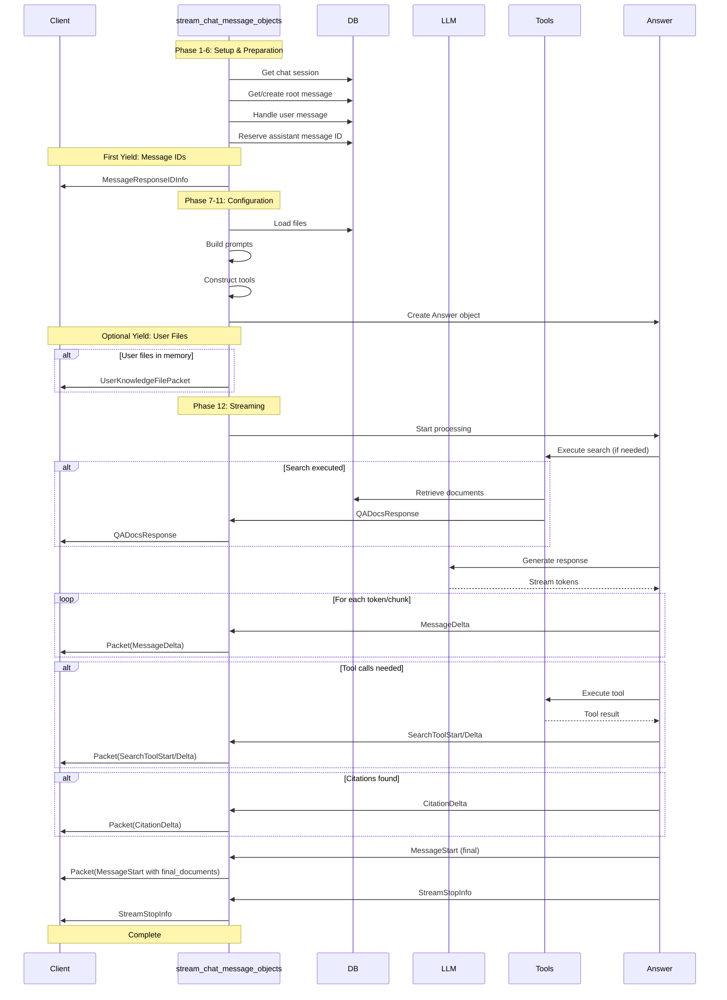
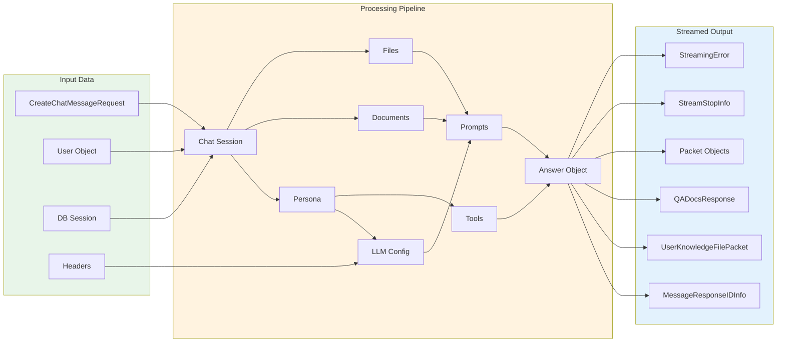

# Detailed Flowchart: stream_chat_message_objects Function

## Complete Flow Diagram

```mermaid
flowchart TD
    Start([START: stream_chat_message_objects called]) --> Init[Phase 1: Initialization]
    
    Init --> GetTenant[Get Current Tenant ID]
    GetTenant --> ExtractParams[Extract Request Parameters:<br/>- use_existing_user_message<br/>- existing_assistant_message_id<br/>- message_text<br/>- chat_session_id<br/>- parent_id<br/>- reference_doc_ids<br/>- retrieval_options]
    ExtractParams --> DisableContext[Disable Surrounding Context<br/>chunks_above = 0<br/>chunks_below = 0]
    
    DisableContext --> Phase2[Phase 2: Chat Session Setup]
    
    Phase2 --> GetSession[Get Chat Session by ID]
    GetSession --> GetRoot[Get or Create Root Message]
    GetRoot --> CheckParent{Parent ID<br/>provided?}
    
    CheckParent -->|Yes| GetParent[Get Parent Message by ID]
    CheckParent -->|No| UseRoot[Use Root Message as Parent]
    
    GetParent --> CheckRegen{Regenerate<br/>request?}
    UseRoot --> CheckRegen
    
    CheckRegen -->|Yes| RegenPath[Rebuild Chat Chain<br/>stop_at_message_id = parent_id]
    CheckRegen -->|No| CheckUseExisting{Use Existing<br/>User Message?}
    
    RegenPath --> ValidateRegen[Validate Chain]
    ValidateRegen --> Phase3
    
    CheckUseExisting -->|No| CreateUserMsg[Create New User Message<br/>- Calculate token count<br/>- Set message type = USER<br/>- Don't commit yet]
    CheckUseExisting -->|Yes| UseExistingPath[Use Existing Message]
    
    CreateUserMsg --> RebuildChain[Rebuild Chat Chain<br/>to verify mainline]
    RebuildChain --> ValidateChain{New message<br/>on mainline?}
    
    ValidateChain -->|No| Rollback1[Rollback DB<br/>Raise RuntimeError]
    ValidateChain -->|Yes| Phase3
    
    UseExistingPath --> ValidateExisting{Last message<br/>is USER or<br/>matches existing?}
    ValidateExisting -->|No| Error1[Raise RuntimeError]
    ValidateExisting -->|Yes| Phase3
    
    Phase3[Phase 3: Persona & Milestones] --> GetPersona[Get Persona for Chat Session]
    GetPersona --> ProcessKG[Process Knowledge Graph Commands<br/>if any in message]
    ProcessKG --> CreateMilestone[Create/Get Multi-Assistant Milestone]
    CreateMilestone --> UpdateMilestone[Update User Assistant Milestone<br/>Track which assistants used]
    UpdateMilestone --> CheckMilestone{Just hit<br/>milestone?}
    
    CheckMilestone -->|Yes| SendTelemetry[Send Telemetry Event]
    CheckMilestone -->|No| Phase4
    
    SendTelemetry --> Phase4
    
    Phase4[Phase 4: LLM Setup] --> ValidateDocs{Reference docs<br/>OR retrieval<br/>options?}
    
    ValidateDocs -->|No| Error2[Raise RuntimeError:<br/>Must specify documents or search]
    ValidateDocs -->|Yes| GetLLMs[Get LLMs for Persona<br/>- Main LLM<br/>- Fast LLM<br/>- Apply overrides]
    
    GetLLMs --> CheckGenAI{GenAI<br/>disabled?}
    CheckGenAI -->|Yes| Error3[Raise RuntimeError:<br/>LLM disabled]
    CheckGenAI -->|No| GetTokenizer[Get Tokenizer for LLM<br/>model_name, provider_type]
    
    GetTokenizer --> GetSearchSettings[Get Current Search Settings]
    GetSearchSettings --> GetDocIndex[Get Default Document Index]
    
    GetDocIndex --> Phase5
    
    Phase5[Phase 5: Document Retrieval Setup] --> CheckRefDocs{Reference<br/>doc IDs<br/>provided?}
    
    CheckRefDocs -->|Yes| RefDocsPath[Reference Documents Path]
    CheckRefDocs -->|No| SearchPath[Search Path]
    
    RefDocsPath --> GetDocIdentifiers[Get Document Query Identifiers<br/>from reference_doc_ids]
    GetDocIdentifiers --> GetSections[Get Inference Sections<br/>from document index]
    GetSections --> GetDBSearchDocs[Get DB Search Docs<br/>by IDs<br/>Filter out deleted]
    GetDBSearchDocs --> SetManualPruning[Set Document Pruning Config:<br/>is_manually_selected_docs = True<br/>max_window_percentage = SELECTED_SECTIONS_MAX_WINDOW_PERCENTAGE]
    SetManualPruning --> Phase6
    
    SearchPath --> SetAutoPruning[Set Document Pruning Config:<br/>max_chunks = persona.num_chunks<br/>max_window_percentage = max_document_percentage]
    SetAutoPruning --> Phase6
    
    Phase6[Phase 6: Message ID Reservation] --> CheckExistingMsg{Existing<br/>assistant<br/>message ID?}
    
    CheckExistingMsg -->|Yes| UseExistingID[Use Existing Message ID]
    CheckExistingMsg -->|No| ReserveID[Reserve New Message ID<br/>for ASSISTANT message]
    
    UseExistingID --> YieldIDs[Yield MessageResponseIDInfo:<br/>- user_message_id<br/>- reserved_assistant_message_id]
    ReserveID --> YieldIDs
    
    YieldIDs --> Phase7
    
    Phase7[Phase 7: File Handling] --> LoadChatFiles[Load All Chat Files<br/>from message history]
    LoadChatFiles --> GetReqFiles[Get Request File Descriptors]
    GetReqFiles --> ParseUserFiles{User files<br/>to parse?}
    
    ParseUserFiles -->|Yes| ParseFiles[Parse User Files:<br/>- Check if can fit in prompt<br/>- Or need search tool<br/>- Load into memory]
    ParseUserFiles -->|No| CheckProjectFiles
    
    ParseFiles --> CheckProjectFiles{Project<br/>files?}
    
    CheckProjectFiles -->|Yes| GetProjectFiles[Get User Files from Project]
    CheckProjectFiles -->|No| AttachFiles
    
    GetProjectFiles --> BuildProjectDocs[Build Project LLM Docs<br/>for citation flow]
    BuildProjectDocs --> AttachFiles[Attach Files to User Message<br/>Exclude project files]
    AttachFiles --> Phase8
    
    Phase8[Phase 8: Prompt Configuration] --> CheckPromptOverride{Prompt<br/>override?}
    
    CheckPromptOverride -->|Persona Override| PersonaOverride[Create PromptConfig from<br/>persona_override_config]
    CheckPromptOverride -->|Prompt Override| PromptOverride[Create PromptConfig from<br/>persona + prompt_override]
    CheckPromptOverride -->|None| DefaultPrompt[Create PromptConfig from<br/>persona only]
    
    PersonaOverride --> GetProjectInstructions
    PromptOverride --> GetProjectInstructions
    DefaultPrompt --> GetProjectInstructions
    
    GetProjectInstructions{Is default<br/>persona?} -->|Yes| GetInstructions[Get Project Instructions<br/>from project_id]
    GetProjectInstructions -->|No| SetAnswerStyle
    
    GetInstructions --> SetAnswerStyle[Set Answer Style Config:<br/>- Citation config<br/>- Structured response format]
    SetAnswerStyle --> Phase9
    
    Phase9[Phase 9: Tool Construction] --> CheckProject{Has project<br/>but no<br/>project files?}
    
    CheckProject -->|Yes| NeverSearch[Set run_search = NEVER]
    CheckProject -->|No| CheckRetrieval{Retrieval<br/>options?}
    
    NeverSearch --> ConstructTools
    CheckRetrieval -->|Yes| UseRetrieval[Use retrieval_options.run_search]
    CheckRetrieval -->|No| AutoSearch[Set run_search = AUTO]
    
    UseRetrieval --> ConstructTools[Construct Tools:<br/>- Search Tool<br/>- Web Search Tool<br/>- Image Generation Tool<br/>- Custom Tools<br/>- Apply allowed_tool_ids filter]
    AutoSearch --> ConstructTools
    
    ConstructTools --> FlattenTools[Flatten Tool Dictionary<br/>into single list]
    FlattenTools --> GetForceSearch[Get Force Search Settings<br/>from request/tools]
    GetForceSearch --> Phase10
    
    Phase10[Phase 10: Message History & Prompts] --> BuildHistory[Build Message History:<br/>Convert chat messages to<br/>PreviousMessage objects]
    BuildHistory --> CheckFeatureFlag{Simple Agent<br/>Framework<br/>enabled?}
    
    CheckFeatureFlag -->|Yes| BuildUserV2[Build User Message v2<br/>default_build_user_message_v2]
    CheckFeatureFlag -->|No| BuildUserV1[Build User Message v1<br/>default_build_user_message]
    
    BuildUserV2 --> CheckFeatureFlag2{Simple Agent<br/>Framework?}
    BuildUserV1 --> CheckFeatureFlag2
    
    CheckFeatureFlag2 -->|Yes| BuildSystemV2[Build System Message v2<br/>default_build_system_message_v2<br/>+ memories callback]
    CheckFeatureFlag2 -->|No| BuildSystemV1[Build System Message v1<br/>default_build_system_message<br/>+ memories callback]
    
    BuildSystemV2 --> CreatePromptBuilder
    BuildSystemV1 --> CreatePromptBuilder
    
    CreatePromptBuilder[Create AnswerPromptBuilder:<br/>- user_message<br/>- system_message<br/>- message_history<br/>- llm_config<br/>- raw_user_query<br/>- raw_user_uploaded_files<br/>- single_message_history]
    
    CreatePromptBuilder --> CheckProjectDocs{Project docs<br/>and no search<br/>tool override?}
    
    CheckProjectDocs -->|Yes| SetContextDocs[Set prompt_builder.context_llm_docs<br/>= project_llm_docs]
    CheckProjectDocs -->|No| Phase11
    
    SetContextDocs --> Phase11
    
    Phase11[Phase 11: Answer Object Creation] --> CreateAnswer[Create Answer Object:<br/>- prompt_builder<br/>- is_connected<br/>- latest_query_files<br/>- answer_style_config<br/>- llm, fast_llm<br/>- force_use_tool<br/>- persona<br/>- rerank_settings<br/>- chat_session_id<br/>- current_agent_message_id<br/>- tools<br/>- db_session<br/>- use_agentic_search<br/>- skip_gen_ai_answer_generation<br/>- project_instructions]
    
    CreateAnswer --> Phase12
    
    Phase12[Phase 12: Streaming Response] --> CheckFeatureFlag3{Simple Agent<br/>Framework<br/>enabled?}
    
    CheckFeatureFlag3 -->|Yes| FastStream[Fast Message Stream:<br/>yield from _fast_message_stream<br/>- answer<br/>- tools<br/>- db_session<br/>- redis_client<br/>- chat_session_id<br/>- reserved_message_id]
    
    CheckFeatureFlag3 -->|No| StandardStream[Standard Stream:<br/>yield from process_streamed_packets<br/>- answer.processed_streamed_output]
    
    FastStream --> StreamPackets[Stream Packets:<br/>- MessageStart<br/>- MessageDelta<br/>- SearchToolStart/Delta<br/>- CustomToolStart/Delta<br/>- CitationDelta<br/>- ReasoningStart/Delta<br/>- QADocsResponse<br/>- StreamStopInfo]
    
    StandardStream --> StreamPackets
    
    StreamPackets --> End([END: Return AnswerStream])
    
    %% Error Handling Paths
    Rollback1 --> ErrorEnd([Error: RuntimeError])
    Error1 --> ErrorEnd
    Error2 --> ErrorEnd
    Error3 --> ErrorEnd
    
    %% Exception Handling
    StreamPackets -.->|Exception| TryCatch[Try-Catch Block]
    TryCatch --> CheckExceptionType{Exception<br/>Type?}
    
    CheckExceptionType -->|ValueError| HandleValueError[Log Exception<br/>Yield StreamingError<br/>Rollback DB<br/>Return]
    CheckExceptionType -->|KGException| ReraiseKG[Re-raise KGException]
    CheckExceptionType -->|ToolCallException| HandleToolError[Yield StreamingError<br/>with stack trace<br/>Rollback DB]
    CheckExceptionType -->|Other Exception| HandleGenericError[Log Exception<br/>Convert LLM error message<br/>Redact API keys<br/>Yield StreamingError<br/>Rollback DB]
    
    HandleValueError --> ErrorEnd
    ReraiseKG --> ErrorEnd
    HandleToolError --> ErrorEnd
    HandleGenericError --> ErrorEnd
    
    style Start fill:#90EE90
    style End fill:#FFB6C1
    style ErrorEnd fill:#FF6B6B
    style Phase2 fill:#87CEEB
    style Phase3 fill:#87CEEB
    style Phase4 fill:#87CEEB
    style Phase5 fill:#87CEEB
    style Phase6 fill:#87CEEB
    style Phase7 fill:#87CEEB
    style Phase8 fill:#87CEEB
    style Phase9 fill:#87CEEB
    style Phase10 fill:#87CEEB
    style Phase11 fill:#87CEEB
    style Phase12 fill:#87CEEB
    style StreamPackets fill:#FFD700
    style YieldIDs fill:#FFD700
```

## Streamed Objects Sequence

## Data Flow Diagram

## Decision Points Summary

| Decision Point | Condition | Path A | Path B |
|---------------|-----------|--------|--------|
| Parent ID | Provided? | Get parent message | Use root message |
| Regenerate | Requested? | Rebuild chain to parent | Continue to new/existing |
| Use Existing | User message? | Use existing | Create new |
| Reference Docs | Provided? | Load specific docs | Prepare search |
| Existing Assistant ID | Provided? | Use existing ID | Reserve new ID |
| User Files | Present? | Parse & load | Skip |
| Project Files | Present? | Load project files | Skip |
| Prompt Override | Type? | Persona/Prompt/None | Different configs |
| Project + No Files | Condition? | Disable search | Allow search |
| Feature Flag | Enabled? | Fast stream | Standard stream |
| Exception | Type? | Different handlers | Error response |

## Key Yield Points

1. **Line 640-643**: `MessageResponseIDInfo` - First object streamed
2. **Line 744-753**: `UserKnowledgeFilePacket` - If user files in memory
3. **Throughout**: `QADocsResponse` - When documents retrieved
4. **Line 827-840**: `Packet` objects - Main streaming content
5. **Throughout**: `StreamingError` - On any error

## Error Recovery Points

- **ValueError**: Rollback DB, yield error, return
- **KGException**: Re-raise (handled upstream)
- **ToolCallException**: Yield error with stack trace
- **Generic Exception**: Sanitize (redact API keys), yield error

